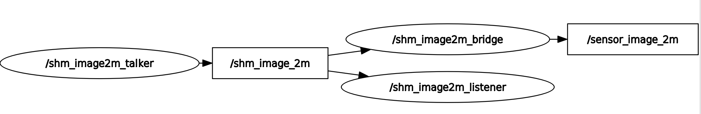
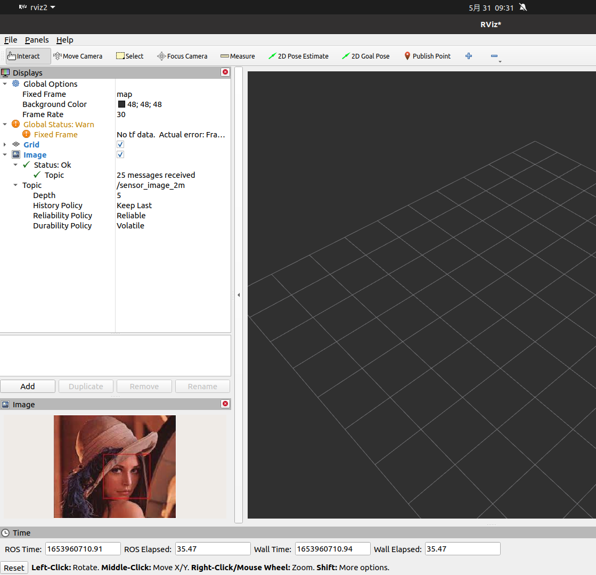
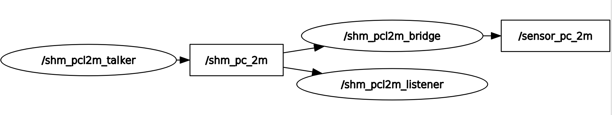
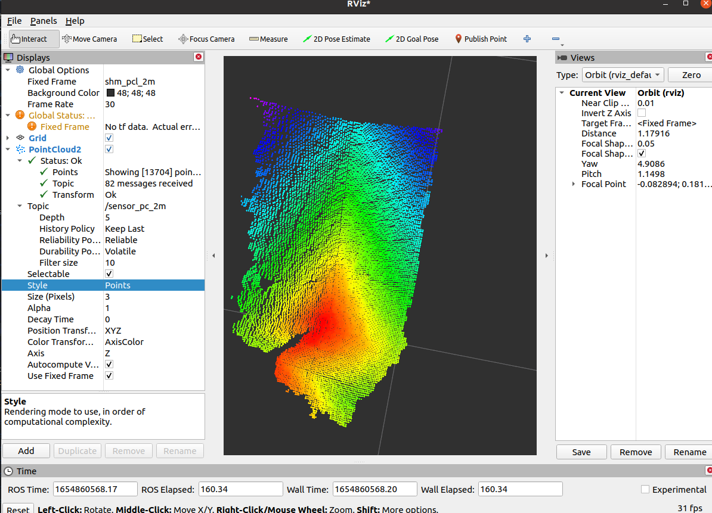

# ros2_shm_msgs

for English please refer [English](./README.md)

## 概述

### 动机

零拷贝机制可以节省IPC过程中的拷贝次数，可以降低cpu占用率和传输时延，对于时间敏感系统和资源受限的计算平台很有用。

对于单进程内使用零拷贝，可以使用[rclcpp intra-process communication](https://docs.ros.org/en/rolling/Tutorials/Demos/Intra-Process-Communication.html)，在dashing版本后就可以使用。

对于ros2应用在IPC场景的零拷贝通信，在foxy版本后提供了loaned-api机制，参考[ros2_design: Zero Copy via Loaned Messages](https://design.ros2.org/articles/zero_copy.html)

### 相关工作

- [ros2_shm_vision_demo: Demonstrate how to use shared memory with image processing algorithms.](https://github.com/MatthiasKillat/ros2_shm_vision_demo)
- [ros2_shm_demo by ApexAI: demonstrates how to use zero-copy Shared Memory data transfer in ROS 2 with CycloneDDS](https://github.com/ApexAI/ros2_shm_demo)

### 本库的主要贡献

该库参考了上述项目实现，以可扩展的方式提供了统一的图像和点云消息定义，类型转换方法，rviz桥接器，示例程序以及性能测试，对IPC(intra-machine, inter-process)零拷贝场景有很好的支持。

## 应用情况

该版本在ros2 galactic和humble中测试通过，以下中间件可用

- rmw_cyclonedds_cpp
  - cyclonedds(0.8.x)+iceoryx(1.0.x)
- rmw_fastrtps_cpp
  - fastdds(>=2.3.x)

关于zero-copy的性能，请看[ros2_jetson_benchmarks](https://github.com/ZhenshengLee/ros2_jetson_benchmarks)，性能测试基于这个基准测试框架[GitHub - ZhenshengLee/performance_test: Github repo for apex.ai performance_test for more middlewares](https://github.com/ZhenshengLee/performance_test)

该库已经应用在 [定制版本的ros2_v4l2_camera](https://github.com/ZhenshengLee/ros2_v4l2_camera) and [定制版本的rslidar_sdk](https://github.com/ros2driver/rslidar_sdk/tree/outdoor/dev_opt_shm), 性能提升显著!

在Dell3630台式机的测试结果，基于fastdds，对于shm_msgs::msg::Image1m的零拷贝数据传输，相比于默认传输机制而言传输时延性能提升80%，from 1.4ms to 0.3ms.

## 设计

### 软件组件

this package includes ros2 msg definitions and demos that supports the msgs.

- shm_msgs::msg::PointCloud8k
- shm_msgs::msg::Image8k
- PointCloud2Modifier8k
- open3d_conversions
- opencv_conversions
- pcl_conversions
- shm_pcl_bridge
- shm_image_bridge
- shm_open3d_bridge

### 开发计划

本包计划支持pointcloud 和 image两种数据类型。

|  feature              | Status                             |
|-----------------------|------------------------------------|
| pointcloud8k          | :heavy_check_mark:                 |
| pointcloud512k        | :heavy_check_mark:                 |
| pointcloud1m          | :heavy_check_mark:                 |
| pointcloud2m          | :heavy_check_mark:                 |
| pointcloud4m          | :heavy_check_mark:                 |
| pointcloud8m          | :heavy_check_mark:                 |
| image8k               | :heavy_check_mark:                 |
| image512k             | :heavy_check_mark:                 |
| image1m               | :heavy_check_mark:                 |
| image2m               | :heavy_check_mark:                 |
| image4m               | :heavy_check_mark:                 |
| image8m               | :heavy_check_mark:                 |
| open3d_conversions    | :heavy_check_mark:                 |
| opencv_conversions    | :heavy_check_mark:                 |
| pcl_conversions       | :heavy_check_mark:                 |
| shm_image_bridge      | :heavy_check_mark:                 |
| shm_open3d_bridge     | :heavy_check_mark:                 |
| shm_pcl_bridge        | :heavy_check_mark:                 |

## 示例程序

### 选择中间件rmw

for rmw_cyclonedds

```sh
export RMW_IMPLEMENTATION=rmw_cyclonedds_cpp
export CYCLONEDDS_URI=file:///$HOME/shm_cyclonedds.xml

# t0
iox-roudi
```

for rmw_fastrtps_cpp

```sh
export RMW_IMPLEMENTATION=rmw_fastrtps_cpp
export FASTRTPS_DEFAULT_PROFILES_FILE=$HOME/shm_fastdds.xml
export RMW_FASTRTPS_USE_QOS_FROM_XML=1
```

### 检查是否启用零拷贝

for rmw_cyclonedds_cpp

```sh
iox-introspection-client --all
# to check if iceoryx_rt process has been created
```

for rmw_fastrtps_cpp，检查是否有内存映射文件生成

```sh
# check if shm-transport
ls /dev/shm/fastrtps_
# check if data-sharing
ls /dev/shm/fast_datasharing*
```

### shm_image图像传输例子

#### run image talker and listener

```sh
# t1
cd ./install/shm_msgs/lib/shm_msgs/
./image1m_talker

# t2
cd ./install/shm_msgs/lib/shm_msgs/
./image1m_listener
```

#### 运行bridge and rviz2

```sh
# configure topic remapping
ros2 launch shm_msgs shm_image_bridge.launch.py
```

to check the msg flow and visualize the msg





### shm_pcl 点云传输例子（基于PCL）

#### run pcl talker and listener

```sh
# t1
cd ./install/shm_msgs/lib/shm_msgs/
./pcl2m_talker

# t2
cd ./install/shm_msgs/lib/shm_msgs/
./pcl2m_listener
```

#### run bridge and rviz2

```sh
# configure topic remapping
ros2 launch shm_msgs shm_pcl_bridge.launch.py
```

to check the msg flow and visualize the msg





### shm_open3d 点云传输例子（基于open3d）

#### run open3d talker and listener

```sh
# t1
cd ./install/shm_msgs/lib/shm_msgs/
./open3d2m_talker

# t2
cd ./install/shm_msgs/lib/shm_msgs/
./open3d2m_listener
```

## 讨论

github and ros2 社区讨论了该库的实现方式和成果。

- [2021 08 05 Eclipse iceoryx developer meetup](https://github.com/eclipse-iceoryx/iceoryx/wiki/2021-08-05-Eclipse-iceoryx-developer-meetup)
- [ros discourse about z copy with cycloedds and iceoryx](https://discourse.ros.org/t/talk-usingzero-copy-data-transfer-in-ros-2/21448/13)
- [ros discourse about using zero copy with ros2_shm_msgs](https://discourse.ros.org/t/using-zero-copy-transport-in-ros2-with-ros2-shm-msgs/26226)
- [autoware.auto issue: Enable zero-copy for pointcloud processing](https://gitlab.com/autowarefoundation/autoware.auto/AutowareAuto/-/issues/1096)
- [image_common issue: Use loaned messages to optimize the performance for image transport](https://github.com/ros-perception/image_common/issues/216)
- [realsense-ros issue: Zero-copy point cloud subscriber in ROS2](https://github.com/IntelRealSense/realsense-ros/issues/2353)

欢迎在本库提交issues。

## 基础知识

### 零拷贝

在ros2的使用表明，当传输数据量大于64k时，零拷贝可以提供显著的性能提升。

关于零拷贝的概念请参考APEX的PPT [Using_Zero_Copy_In_ROS2.pdf](./doc/Using_Zero_Copy_In_ROS2.pdf)

简单讲，零拷贝机制需要自顶向下所有软件层的支持

对于CycloneDDS，参考[doc from cyclonedds](https://github.com/eclipse-cyclonedds/cyclonedds/blob/master/docs/manual/shared_memory.rst)和[doc from rmw_cyclonedds](https://github.com/ros2/rmw_cyclonedds/blob/master/shared_memory_support.md)

对于FastDDS，参考[doc from fastdds](https://fast-dds.docs.eprosima.com/en/latest/fastdds/use_cases/zero_copy/zero_copy.html) and [doc from rmw_cyclonedds](https://fast-dds.docs.eprosima.com/en/latest/fastdds/ros2/ros2.html)

### 最少拷贝

当没有固定大小数据类型时，IPC需要序列化和反序列化操作，所以数据拷贝不可避免

但是与传统dds基于Loopback的网络通信（比如udp 组播）相比，数据拷贝的次数依然有减少。

所以在最少拷贝的传输方式下，性能依然能够得到提升。

### 相关中间件

大陆集团的中间件 [eCAL](https://continental.github.io/ecal/) 使用了iceoryx制作了零拷贝数据传输通道，不过需要从源代码编译，增加额外的编译选项。

性能请参考 [The performance of eCAL](https://continental.github.io/ecal/advanced/performance.html), 编译方式和选项请看 [Enable ECAL_LAYER_ICEORYX](https://continental.github.io/ecal/development/ecal_cmake_options.html)

eCAL 也提供了自己的基于共享内存的传输通道，虽然不能得到零拷贝，但是可以实现最少拷贝，其性能可以查看[this issue](https://github.com/continental/ecal/issues/326)

Cyclonedds和eCAL都使用iceoryx作为零拷贝的传输通道

Iceoryx同样可以提供rmw的接口，查看[rmw_iceoryx](https://github.com/ros2/rmw_iceoryx)

FastDDS在v2.2后提供了zero copy功能，所以在rmw_fastrtps的支持下，在ros2-galactic中也能使用loaned-api.

## 鸣谢

[Iceoryx](https://iceoryx.io/)
[Apex.AI](http://apex.ai/)
[CycloneDDS](https://www.adlinktech.com/en/CycloneDDS)
[eCAL](http://ecal.io/)

## Q&A

todo.

## 更多中文材料

关于分布式系统的性能请阅读 [理论基础](./doc/design/performance_of_distributed_sys.md)
